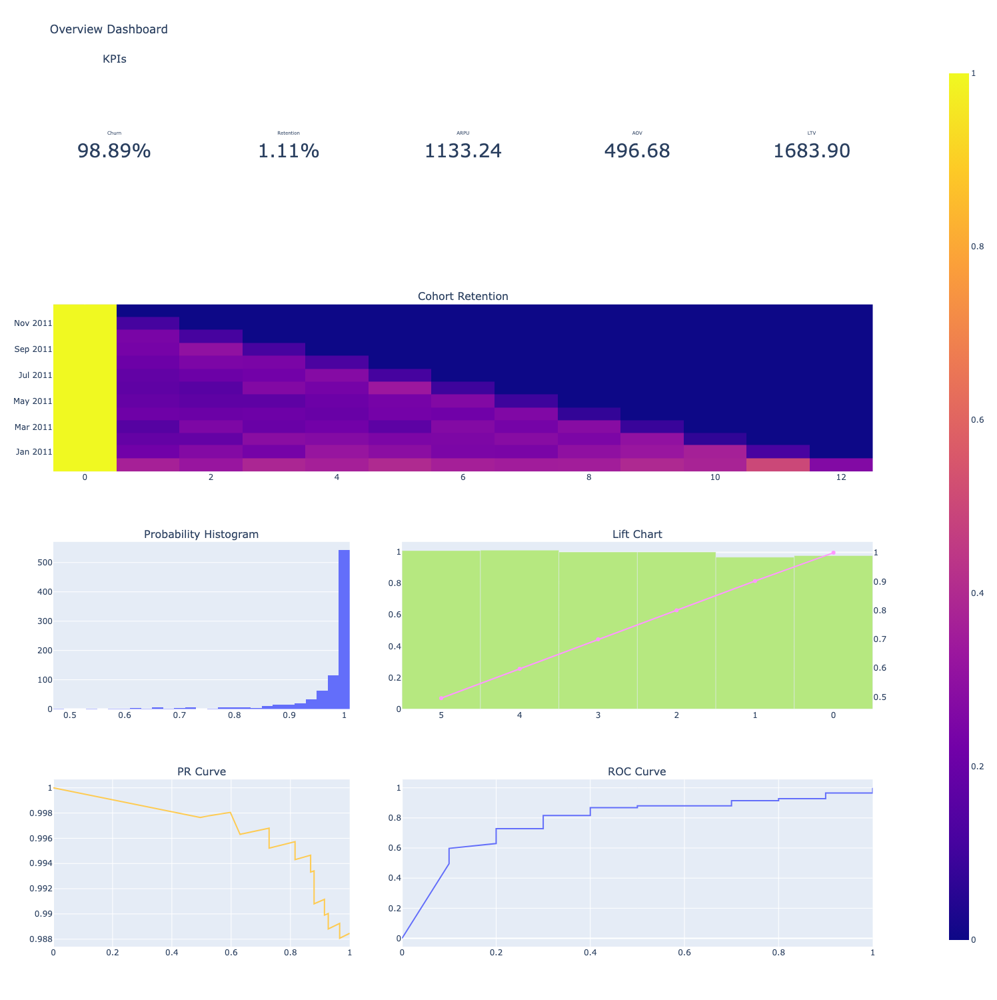
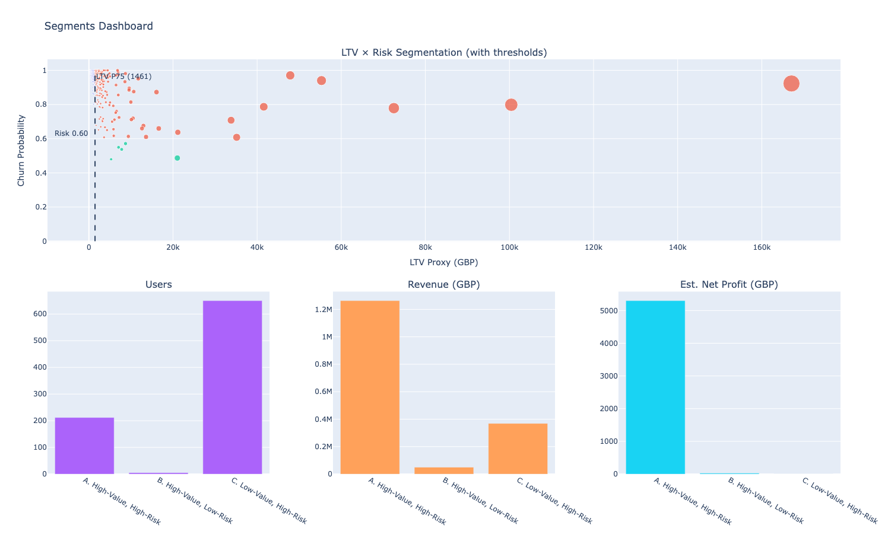
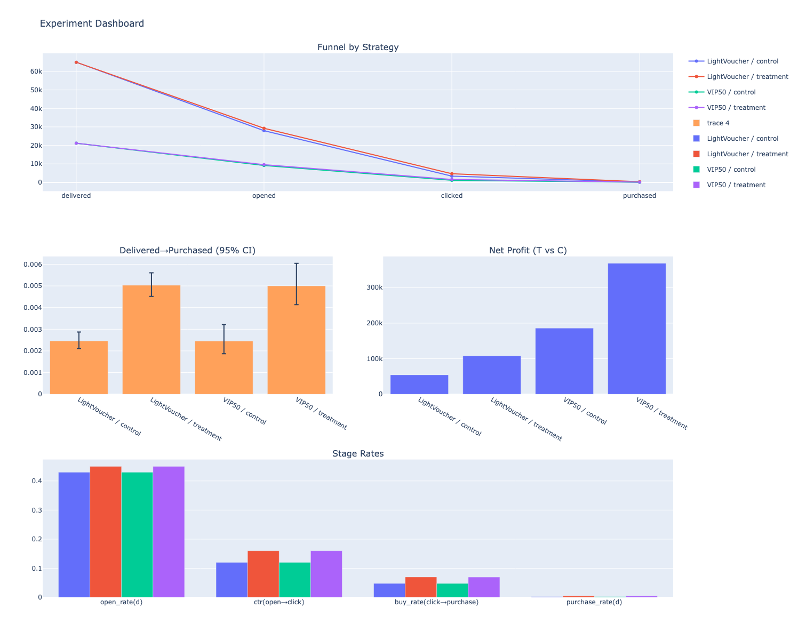

# Churn Prediction & Retention Playbook (Online Retail)
[]([<YOUR_COLAB_LINK>](https://colab.research.google.com/drive/1oLuJUnUtsHdYQle4Ax4-zX7KavDLr-qu?usp=sharing))

## Goal
Predict 30-day churn and design **LTV × Risk** interventions that maximize **net profit**.

## Highlights
- **Time-based labeling**: Observation **90d**, Prediction **30d** (prevents label leakage)
- Features: **RFM**, activity/behavior (e.g., AOV, quantity, item diversity), **returns rate**, country, **wholesaler heuristic**
- Models: **Random Forest / Logistic Regression** with class imbalance handling; recall-first thresholding
- Evaluation: **Recall, Precision, F1, ROC-AUC**, Probability Histogram, **Lift Chart**, cohort retention  
- Actions: **2×2 LTV × Risk** segments with **costed ROI**; A/B funnel with **Wilson 95% CI**

## Results (example run)
- **Recall**: **75.89%** - **Precision**: **68.01%** - **F1**: **71.73%**  
- **ROC-AUC**: **0.704**  - PR-AUC: **0.7363**
- **Segment uplift (estimated, GBP)**  
  - **A (High-Value × High-Risk)** — Count **11**, Avg LTV **£2,528.52**, **Net uplift £275.00**  
  - **B (High-Value × Low-Risk)** — Count **173**, Avg LTV **£4,817.27**, **Net uplift £865.00**  
  - **C (Low-Value × High-Risk)** — Count **313**, Avg LTV **£380.50**, **Net uplift £0.00**  
  - **D (Low-Value × Low-Risk)** — Count **239**, Avg LTV **£783.40**, **Net uplift −£119.50**  
  - **Total projected net uplift**: **£1,020.50** (under current cost & margin assumptions)
### Dashboards
- Overview: KPI cards, cohort retention, probability histogram, Lift, PR, ROC  
<p align="center">
  <a href="https://<user>.github.io/<repo>/figs/overview_dashboard.html">
    
  </a>
</p>

- Segments: LTV × Risk scatter with thresholds + segment size/revenue/profit  
<p align="center">
  <a href="https://<user>.github.io/<repo>/figs/segments_dashboard.html">
    
  </a>
</p>

- Experiment: A/B funnel (Delivered→Opened→Clicked→Purchased), 95% Wilson CI, net profit  
<p align="center">
  <a href="https://<user>.github.io/<repo>/figs/experiment_dashboard.html">
    
  </a>
</p>

## Quickstart
**Option A — One-Click Notebook (recommended)**
1. Create & activate a Python 3.10+ environment
2. Install deps and the package (editable):
```bash
pip install -r requirements.txt
pip install -e .
```
3. Launch Jupyter and open:
```bash
notebooks/Churn_Playbook_Single_Notebook.ipynb
```
4. Run top → bottom. All artifacts and dashboards will be saved to:
```bash
outputs/
```
**Option B — CLI (optional)**
```bash
# If you prefer a script entrypoint
python scripts/run_all.py --csv data/raw/OnlineRetail.csv --out outputs/
```

## Data
Kaggle — *Online Retail Dataset* (Ulrik Thyge Pedersen)  
  https://www.kaggle.com/datasets/ulrikthygepedersen/online-retail-dataset/data

**Schema**  
`InvoiceNo` (6-digit; **starts with ‘C’ = cancellation**), `StockCode`, `Description`, `Quantity`, `InvoiceDate`, `UnitPrice`, `CustomerID`, `Country`.

**Preprocessing (this project)**  
- Remove cancellations (`InvoiceNo` startswith **'C'**)  
- `Sales = Quantity × UnitPrice` (GBP)  
- Windows: **Obs 90d**, **Pred 30d**; **churn = no purchase in Pred window**  
- **Wholesaler** heuristic: `AOV ≥ P90` **or** `avg_lines_per_invoice ≥ 10`

**Download via Kaggle API**
```bash
pip install kaggle
kaggle datasets download -d ulrikthygepedersen/online-retail-dataset -p data/raw -f OnlineRetail.csv --unzip

Note: Please do not commit the raw CSV to the repo. Provide commands/scripts to fetch instead.
Accessed: 2025-10-19 (UTC-7).
```
Note: Please do not commit the raw CSV to the repo. Provide commands/scripts to fetch instead.
Accessed: 2025-10-19 (UTC-7)

## Methods
- Labeling
  - Time-based cut at t_ref: build features on (t_ref − 90d, t_ref], mark churn if no purchase in (t_ref, t_ref + 30d]
- Features
  - RFM: Recency / Frequency / Monetary
  - Activity/behavior: AvgOrderValue, unique items, total quantity
  - Returns rate in observation window
  - Country (top-K one-hot)
  - IsWholesaler flag
- Modeling & Evaluation
  - Algorithms: Random Forest / Logistic Regression (class_weight='balanced')
  - Metrics: Recall, Precision, F1, ROC-AUC, PR-AUC
  - Plots: Probability histogram, Lift（deciles）, PR/ROC curves, cohort retention
- Segmentation & Policy
  - Thresholds: Risk ≥ 0.6; LTV ≥ P75
  - Segments: A/B/C/D (Value × Risk)
  - Policy simulation: per-segment uplift rate, offer cost, margin → estimated net profit
- Experiment (Simulated)
  - Aggregated A/B per strategy: Delivered → Opened → Clicked → Purchased
  - 95% Wilson CI on conversion; net profit = revenue × margin − offer cost


## Live Artifacts
- outputs/figs/overview_dashboard.html
- outputs/figs/segments_dashboard.html
- outputs/figs/experiment_dashboard.html
- outputs/model_metrics.json
- outputs/latest_scores_and_segments.csv
> Tip: add outputs/ to .gitignore to avoid committing large generated files.

## Repo Map
```bash
churn-retention-playbook/
├─ README.md
├─ LICENSE
├─ requirements.txt
├─ pyproject.toml
├─ src/
│  └─ churn_playbook/
│     ├─ __init__.py
│     ├─ etl.py                    # cleaning; cancellations; Sales
│     ├─ features.py               # RFM/behavior/seasonality/country/returns/wholesale
│     ├─ labeling.py               # 90d+30d windows; churn rule
│     ├─ modeling.py               # LR/RF; metrics; PR/ROC/Lift/Histo
│     ├─ policy.py                 # LTV×Risk segmentation; ROI simulation
│     ├─ experiment.py             # Simulate aggregated A/B from segments
│     └─ plotly_helpers.py         # Plotly figures & combined dashboards
├─ notebooks/
│  └─ Churn_Playbook_Single_Notebook.ipynb
├─ scripts/
│  └─ run_all.py                   # optional CLI
└─ outputs/                        # generated (gitignored)
   ├─ figs/
   └─ artifacts/
```
## License & Citation
-	License: MIT (see LICENSE)
-	Cite: Kaggle — Online Retail Dataset (Ulrik Thyge Pedersen)
